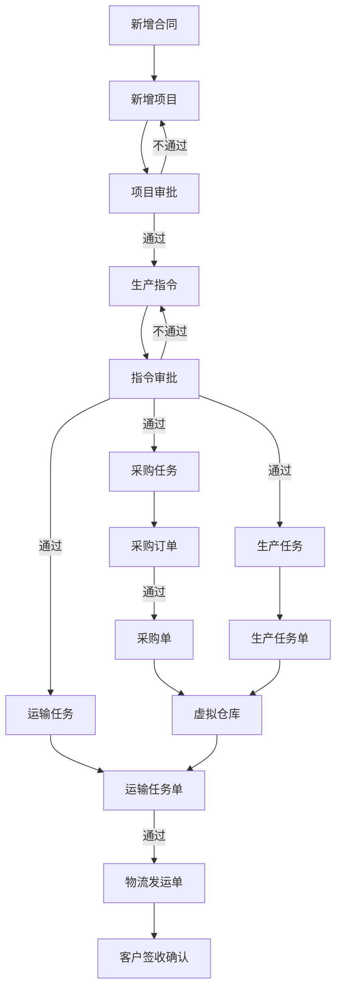

## 主要流程图

# 业务单据

## 新增合同
-----

- 合同信息

|序号|合同名称|合同编号|合同金额|合同签订日期|合同签订人|客户名称|合同签订备注|合同文件|
|--|--|--|--|--|--|--|--|--|

- 合同明细  

|序号|机型|物料名称|物料编号|物料规格|执行标准|物料单位|物料数量|产品单价|备注|
|--|--|--|--|--|--|--|--|--|--|

## 新增项目
-----

- 项目信息

|序号|项目名称|产品类型|项目描述|交付日期|项目联系人|收货地址|
|--|--|--|--|--|--|--|
-----
- 物料明细

|序号|机型|物料名称|物料编号|物料规格|执行标准|物料单位|物料数量|备注|
|--|--|--|--|--|--|--|--|--|

## 生产指令
-----

- 指令信息  

|序号|项目名称|指令名称|指令编号|指令日期|指令状态|
|--|--|--|--|--|--|

- 指令明细

|序号|机型|物料名称|物料编号|物料规格|执行标准|物料单位|物料数量|备注|
|--|--|--|--|--|--|--|--|--|

## 生产任务

- 生产任务单

|序号|指令名称|指令编号|指令日期|指令状态|
|--|--|--|--|--|

- 生产任务明细

|序号|机型|物料名称|物料编号|物料规格|执行标准|物料单位|物料数量|备注|  
|--|--|--|--|--|--|--|--|--| 

## 采购任务

- 采购任务单

|序号|指令名称|指令编号|指令日期|指令状态|
|--|--|--|--|--|

- 采购任务明细

|序号|机型|物料名称|物料编号|物料规格|执行标准|物料单位|物料数量|备注|
|--|--|--|--|--|--|--|--|--|

## 运输任务

- 运输任务单

|序号|项目名称|指令编号|收货地址|收货人|指令日期|指令状态|
|--|--|--|--|--|--|--|

- 运输任务明细

|序号|机型|物料名称|物料编号|物料规格|执行标准|物料单位|物料数量|备注|
|--|--|--| --|--|--|--|--|--|

**单据流转总项目开始到客户签收结束为项目管理的主要内,看板展示各个节点的流转状态**

## 基本数据表

- 物料信息

|物料类型|物料编码|物料名称|物料编号|物料规格|执行标准|材质|物料单位|备注|
|--|--|--|--|--|--|--|--|--|

- 物料类型

|id|类型名称|材质|备注|
|--|--|--|--|

- 用户表

|id|用户名|密码|角色|
|--|--|--|--|
- 权限表

|id|权限名称|权限描述|
|--|--|--|

- 客户表

|id|客户名称|客户联系人|客户地址|客户电话|
|--|--|--|--|--|

- 供应商表

|id|供应商名称|供应商联系人|供应商地址|供应商电话|
|--|--|--|--|--|

- 承运商表

|id|承运商名称|承运商联系人|承运商地址|承运商电话|
|--|--|--|--|--|