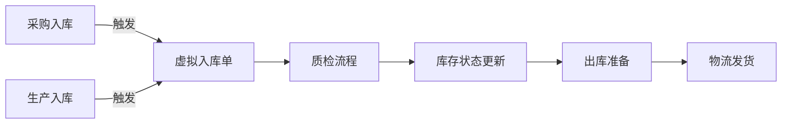

以下是基于业务流程转换的前端功能模块划分方案，将虚拟仓库优化整合到现有系统中：

```markdown:x:\demo\前端功能模块划分方案.md
# 前端功能模块划分方案

## 一、主功能模块划分

### 1. 合同管理模块
- **子功能**：
  - 合同创建与编辑
  - 合同审批流程
  - 合同关联项目管理
  - 合同文件管理

### 2. 项目管理模块
- **子功能**：
  - 项目创建（自动/手动）
  - 项目进度看板
  - 物料需求计划
  - 交付管理

### 3. 生产管理模块
- **子功能**：
  - 生产指令生成
  - 任务分配与调度
  - 生产进度跟踪
  - 生产完工报告
  - 生产入库申请
  - 异常处理

### 4. 采购管理模块
- **子功能**：
  - 采购需求生成
  - 供应商比价
  - 采购订单管理
  - 到货验收

### 5. 虚拟仓库模块（新增）
- **子功能**：
  - 统一入库管理
  - 库存状态看板
  - 质检管理
  - 批次追踪
  - 出库管理

### 6. 物流管理模块
- **子功能**：
  - 运输任务分配
  - 承运商管理
  - 发货单生成
  - 签收确认


## 二、核心功能交互设计

### 虚拟仓库相关功能流程



## 三、关键接口设计

1. **虚拟仓库接口**：
```typescript:x:\demo\api\inventory.ts
interface VirtualWarehouse {
  // 入库接口
  createInbound(order: PurchaseOrder | ProductionOrder): Promise<InboundTicket>;
  
  // 质检接口
  submitQualityCheck(ticketId: string, result: QualityResult): Promise<void>;
  
  // 库存查询
  getInventoryStatus(materialId: string): Promise<InventoryStatus>;
}
```

## 四、实施优先级

阶段 | 模块 | 子功能 | 周期
---|---|---|---
1 | 虚拟仓库 | 基础入库/出库 | 2周
2 | 虚拟仓库 | 质检流程 | 1周
3 | 虚拟仓库 | 批次追踪 | 1周
4 | 其他模块 | 流程对接 | 2周

## 五、UI组件规划

1. **通用组件**：
   - 状态标签组件（显示质检/库存状态）
   - 批次选择器
   - 库存可视化看板

2. **专用组件**：
   - 入库单创建向导
   - 质检结果录入表单
   - 库存调拨面板
```

该方案特点：
1. 将虚拟仓库作为独立模块，同时保持与其他模块的紧密集成
2. 明确了各模块间的数据流和交互关系
3. 提供了可渐进式实施的开发路径
4. 包含必要的接口设计和UI组件规划

实施时建议采用模块化开发方式，先构建虚拟仓库核心功能，再逐步对接其他业务模块。