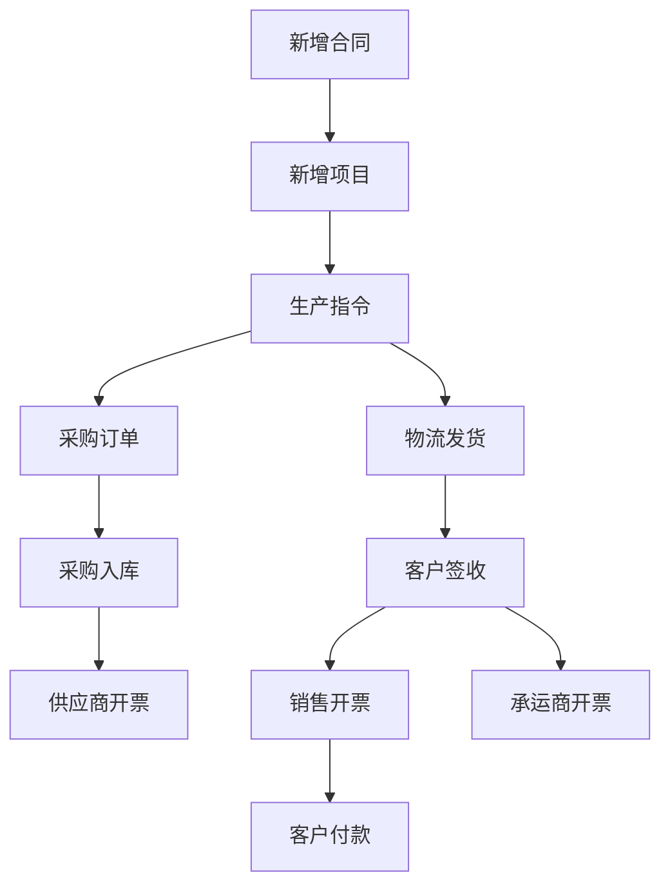

****

-------

# 应用数据库设计文档

**版本:** 1.0
**日期:** 2025年3月22日

## 1. 业务流程

### 1.1 一般业务流程

1.  **新增合同 (New Contract)**
    * 对应数据表：合同主表 (Contracts Table)，合同产品明细表 (Contract_Products Table)
2.  **新增项目 (New Project)**
    * 对应数据表：项目主表 (Projects Table)，项目产品明细表 (Project_Products Table)
3.  **生产指令 (Production Instruction)**
    * 对应数据表：生产指令主表 (Production_Instructions Table)，生产指令产品明细表 (Production_Instruction_Products Table)
4.  **采购订单 (Purchase Order)**
    * 对应数据表：采购订单主表 (Purchase_Orders Table)，采购订单明细表 (Purchase_Order_Items Table)
5.  **采购入库 (Purchase Inbound)**
    * 对应数据表：采购入库主表 (Purchase_Inbounds Table)，采购入库明细表 (Purchase_Inbound_Items Table)
6.  **供应商开票 (Supplier Invoice)**
    * 对应数据表：供应商发票表 (Supplier_Invoices Table)
7.  **物流发货 (Logistics/Shipping)**
    * 对应数据表：物流发货表 (Shipments Table)
8.  **客户签收 (Customer Sign-off)**
    * 通过更新物流发货表 (Shipments Table) 中的 `sign_off_status` 和 `sign_off_date` 字段实现。
9.  **销售开票 (Sales Invoice)**
    * 对应数据表：销售发票表 (Sales_Invoices Table)
10. **承运商开票 (Carrier Invoice)**
    * 对应数据表：承运商发票表 (Carrier_Invoices Table)，物流发货与承运商发票关联表 (Shipment_Carrier_Invoices Table)
11. **客户付款 (Customer Payment)**
    * 对应数据表：客户付款表 (Customer_Payments Table)

### 1.2 特殊业务流程

* **合同审批中，直接下达生产指令：** 在合同仍在审批但已确定合作的情况下，可以直接创建生产指令。此时，生产指令主表中的 `project_id` 和 `contract_id` 字段可以为空。后续合同和项目创建后，需要提供功能将这些生产指令关联起来。

## 2. 生产指令编号规则

生产指令编号格式为：`YYY-M-X`
* `YYY`：年份（例如：2025）
* `M`：月份（1-12）
* `X`：当月生成的生产指令序号，从 1 开始，每月重置。

## 3. 数据表字段

### 3.1 合同主表 (Contracts Table)

| 字段名            | 数据类型  | 长度  | 是否为空 | 备注                           |
| ----------------- | --------- | ----- | -------- | ------------------------------ |
| `contract_id`     | INT       |       | 否       | 合同ID（主键，自增）           |
| `contract_no`     | VARCHAR   | 255   | 否       | 合同编号                       |
| `sign_date`       | DATE      |       | 否       | 签订日期                       |
| `customer_name`   | VARCHAR   | 255   | 否       | 客户名称                       |
| `contract_name`   | VARCHAR   | 255   | 否       | 合同名称                       |
| `payment_nodes`   | TEXT      |       | 是       | 支付节点（例如：JSON格式存储） |
| `contract_amount` | DECIMAL   | 10, 2 | 否       | 合同金额                       |
| `created_at`      | TIMESTAMP |       | 是       | 创建时间                       |
| `updated_at`      | TIMESTAMP |       | 是       | 更新时间                       |

### 3.2 合同产品明细表 (Contract_Products Table)

| 字段名                  | 数据类型 | 长度  | 是否为空 | 备注                         |
| ----------------------- | -------- | ----- | -------- | ---------------------------- |
| `item_id`               | INT      |       | 否       | 明细ID（主键，自增）         |
| `contract_id`           | INT      |       | 否       | 合同ID（外键，关联合同主表） |
| `serial_number`         | INT      |       | 是       | 序号                         |
| `product_type`          | VARCHAR  | 255   | 是       | 产品类型                     |
| `product_code`          | VARCHAR  | 255   | 是       | 产品编号                     |
| `product_name`          | VARCHAR  | 255   | 否       | 产品名称                     |
| `product_specification` | VARCHAR  | 255   | 是       | 产品规格                     |
| `execution_standard`    | VARCHAR  | 255   | 是       | 执行标准                     |
| `material`              | VARCHAR  | 255   | 是       | 材质                         |
| `quantity`              | DECIMAL  | 10, 2 | 否       | 数量                         |
| `unit`                  | VARCHAR  | 50    | 否       | 单位                         |
| `unit_price`            | DECIMAL  | 10, 2 | 否       | 单价                         |
| `subtotal`              | DECIMAL  | 10, 2 | 否       | 小计                         |
| `remarks`               | TEXT     |       | 是       | 备注                         |

### 3.3 项目主表 (Projects Table)

| 字段名             | 数据类型  | 长度 | 是否为空 | 备注                                   |
| ------------------ | --------- | ---- | -------- | -------------------------------------- |
| `project_id`       | INT       |      | 否       | 项目ID（主键，自增）                   |
| `project_no`       | VARCHAR   | 255  | 否       | 项目编号                               |
| `project_name`     | VARCHAR   | 255  | 否       | 项目名称                               |
| `customer_name`    | VARCHAR   | 255  | 否       | 客户名称                               |
| `delivery_date`    | DATE      |      | 否       | 交付日期                               |
| `project_contact`  | VARCHAR   | 255  | 是       | 项目联系人                             |
| `contact_phone`    | VARCHAR   | 255  | 是       | 联系人电话                             |
| `shipping_address` | TEXT      |      | 是       | 收货地址                               |
| `created_at`       | TIMESTAMP |      | 是       | 创建时间                               |
| `updated_at`       | TIMESTAMP |      | 是       | 更新时间                               |
| `project_status`   | VARCHAR   | 50   | 是       | 项目状态（可选值：暂停，进行中，完成） |

### 3.4 项目产品明细表 (Project_Products Table)

| 字段名                  | 数据类型 | 长度  | 是否为空 | 备注                         |
| ----------------------- | -------- | ----- | -------- | ---------------------------- |
| `item_id`               | INT      |       | 否       | 明细ID（主键，自增）         |
| `project_id`            | INT      |       | 否       | 项目ID（外键，关联项目主表） |
| `serial_number`         | INT      |       | 是       | 序号                         |
| `product_type`          | VARCHAR  | 255   | 是       | 产品类型                     |
| `product_code`          | VARCHAR  | 255   | 是       | 产品编号                     |
| `product_name`          | VARCHAR  | 255   | 否       | 产品名称                     |
| `product_specification` | VARCHAR  | 255   | 是       | 产品规格                     |
| `execution_standard`    | VARCHAR  | 255   | 是       | 执行标准                     |
| `material`              | VARCHAR  | 255   | 是       | 材质                         |
| `quantity`              | DECIMAL  | 10, 2 | 否       | 数量                         |
| `unit`                  | VARCHAR  | 50    | 否       | 单位                         |
| `quantity_per_unit`     | DECIMAL  | 10, 2 | 是       | 单台数量                     |
| `remarks`               | TEXT     |       | 是       | 备注                         |

### 3.5 生产指令主表 (Production_Instructions Table)

| 字段名            | 数据类型  | 长度 | 是否为空 | 备注                                       |
| ----------------- | --------- | ---- | -------- | ------------------------------------------ |
| `instruction_id`  | INT       |      | 否       | 生产指令ID（主键，自增）                   |
| `project_id`      | INT       |      | 是       | 项目ID（外键，关联项目主表，允许为空）     |
| `contract_id`     | INT       |      | 是       | 合同ID（外键，关联合同主表，允许为空）     |
| `instruction_no`  | VARCHAR   | 255  | 否       | 生产指令编号（格式：YYY-M-X，X为月度序号） |
| `project_name`    | VARCHAR   | 255  | 是       | 项目名称（从项目表复制，允许为空）         |
| `customer_name`   | VARCHAR   | 255  | 是       | 客户名称（从项目或合同表复制，允许为空）   |
| `delivery_date`   | DATE      |      | 否       | 交付日期                                   |
| `approval_status` | VARCHAR   | 50   | 否       | 审核状态（例如：待审核、已审核、已驳回）   |
| `approver`        | VARCHAR   | 255  | 是       | 审核人                                     |
| `approval_date`   | DATE      |      | 是       | 审核日期                                   |
| `created_at`      | TIMESTAMP |      | 是       | 创建时间                                   |
| `updated_at`      | TIMESTAMP |      | 是       | 更新时间                                   |

### 3.6 生产指令产品明细表 (Production_Instruction_Products Table)

| 字段名                  | 数据类型 | 长度  | 是否为空 | 备注                                       |
| ----------------------- | -------- | ----- | -------- | ------------------------------------------ |
| `item_id`               | INT      |       | 否       | 明细ID（主键，自增）                       |
| `instruction_id`        | INT      |       | 否       | 生产指令ID（外键，关联生产指令主表）       |
| `project_product_id`    | INT      |       | 否       | 项目产品明细ID（外键，关联项目产品明细表） |
| `serial_number`         | INT      |       | 是       | 序号（从项目产品明细复制）                 |
| `product_type`          | VARCHAR  | 255   | 是       | 产品类型（从项目产品明细复制）             |
| `product_code`          | VARCHAR  | 255   | 是       | 产品编号（从项目产品明细复制）             |
| `product_name`          | VARCHAR  | 255   | 否       | 产品名称（从项目产品明细复制）             |
| `product_specification` | VARCHAR  | 255   | 是       | 产品规格（从项目产品明细复制）             |
| `execution_standard`    | VARCHAR  | 255   | 是       | 执行标准（从项目产品明细复制）             |
| `material`              | VARCHAR  | 255   | 是       | 材质（从项目产品明细复制）                 |
| `quantity`              | DECIMAL  | 10, 2 | 否       | 数量（从项目产品明细复制）                 |
| `unit`                  | VARCHAR  | 50    | 否       | 单位（从项目产品明细复制）                 |
| `quantity_per_unit`     | DECIMAL  | 10, 2 | 是       | 单台数量（从项目产品明细复制）             |
| `remarks`               | TEXT     |       | 是       | 备注（从项目产品明细复制）                 |

### 3.7 采购订单主表 (Purchase_Orders Table)

| 字段名                   | 数据类型  | 长度  | 是否为空 | 备注                                                         |
| ------------------------ | --------- | ----- | -------- | ------------------------------------------------------------ |
| `po_id`                  | INT       |       | 否       | 采购订单ID（主键，自增）                                     |
| `po_no`                  | VARCHAR   | 255   | 否       | 采购订单编号                                                 |
| `instruction_id`         | INT       |       | 否       | 生产指令ID（外键，关联生产指令主表）                         |
| `supplier_name`          | VARCHAR   | 255   | 否       | 供应商名称                                                   |
| `supplier_contact`       | VARCHAR   | 255   | 是       | 供应商联系人                                                 |
| `supplier_phone`         | VARCHAR   | 255   | 是       | 供应商电话                                                   |
| `purchase_date`          | DATE      |       | 否       | 采购日期                                                     |
| `expected_delivery_date` | DATE      |       | 是       | 预计交货日期                                                 |
| `purchaser`              | VARCHAR   | 255   | 是       | 采购员                                                       |
| `po_status`              | VARCHAR   | 50    | 否       | 采购订单状态（例如：草稿、已发送、部分收货、已收货、已取消） |
| `total_amount`           | DECIMAL   | 10, 2 | 是       | 采购订单总金额                                               |
| `created_at`             | TIMESTAMP |       | 是       | 创建时间                                                     |
| `updated_at`             | TIMESTAMP |       | 是       | 更新时间                                                     |

### 3.8 采购订单明细表 (Purchase_Order_Items Table)

| 字段名                   | 数据类型 | 长度  | 是否为空 | 备注                                               |
| ------------------------ | -------- | ----- | -------- | -------------------------------------------------- |
| `item_id`                | INT      |       | 否       | 明细ID（主键，自增）                               |
| `po_id`                  | INT      |       | 否       | 采购订单ID（外键，关联采购订单主表）               |
| `instruction_product_id` | INT      |       | 否       | 生产指令产品明细ID（外键，关联生产指令产品明细表） |
| `serial_number`          | INT      |       | 是       | 序号（从生产指令产品明细复制）                     |
| `product_type`           | VARCHAR  | 255   | 是       | 产品类型（从生产指令产品明细复制）                 |
| `product_code`           | VARCHAR  | 255   | 是       | 产品编号（从生产指令产品明细复制）                 |
| `product_name`           | VARCHAR  | 255   | 否       | 产品名称（从生产指令产品明细复制）                 |
| `product_specification`  | VARCHAR  | 255   | 是       | 产品规格（从生产指令产品明细复制）                 |
| `execution_standard`     | VARCHAR  | 255   | 是       | 执行标准（从生产指令产品明细复制）                 |
| `material`               | VARCHAR  | 255   | 是       | 材质（从生产指令产品明细复制）                     |
| `quantity`               | DECIMAL  | 10, 2 | 否       | 数量（从生产指令产品明细复制）                     |
| `unit`                   | VARCHAR  | 50    | 否       | 单位（从生产指令产品明细复制）                     |
| `quantity_per_unit`      | DECIMAL  | 10, 2 | 是       | 单台数量（从生产指令产品明细复制）                 |
| `unit_price`             | DECIMAL  | 10, 2 | 否       | 单价                                               |
| `subtotal`               | DECIMAL  | 10, 2 | 是       | 小计（数量 \* 单价）                               |
| `remarks`                | TEXT     |       | 是       | 备注（从生产指令产品明细复制）                     |

### 3.9 采购入库主表 (Purchase_Inbounds Table)

| 字段名                   | 数据类型  | 长度  | 是否为空 | 备注                                       |
| ------------------------ | --------- | ----- | -------- | ------------------------------------------ |
| `inbound_id`             | INT       |       | 否       | 入库ID（主键，自增）                       |
| `inbound_no`             | VARCHAR   | 255   | 否       | 入库单号                                   |
| `po_id`                  | INT       |       | 否       | 采购订单ID（外键，关联采购订单主表）       |
| `supplier_name`          | VARCHAR   | 255   | 否       | 供应商名称（从采购订单复制）               |
| `supplier_contact`       | VARCHAR   | 255   | 是       | 供应商联系人（从采购订单复制）             |
| `supplier_phone`         | VARCHAR   | 255   | 是       | 供应商电话（从采购订单复制）               |
| `purchase_date`          | DATE      |       | 否       | 采购日期（从采购订单复制）                 |
| `expected_delivery_date` | DATE      |       | 是       | 预计交货日期（从采购订单复制）             |
| `purchaser`              | VARCHAR   | 255   | 是       | 采购员（从采购订单复制）                   |
| `inbound_date`           | DATE      |       | 否       | 实际入库日期                               |
| `receiver`               | VARCHAR   | 255   | 是       | 收货人                                     |
| `inbound_status`         | VARCHAR   | 50    | 否       | 入库状态（例如：待收货、部分收货、已收货） |
| `total_amount`           | DECIMAL   | 10, 2 | 是       | 采购订单总金额（从采购订单复制）           |
| `created_at`             | TIMESTAMP |       | 是       | 创建时间                                   |
| `updated_at`             | TIMESTAMP |       | 是       | 更新时间                                   |

### 3.10 采购入库明细表 (Purchase_Inbound_Items Table)

| 字段名                   | 数据类型 | 长度  | 是否为空 | 备注                                               |
| ------------------------ | -------- | ----- | -------- | -------------------------------------------------- |
| `item_id`                | INT      |       | 否       | 明细ID（主键，自增）                               |
| `inbound_id`             | INT      |       | 否       | 入库ID（外键，关联采购入库主表）                   |
| `po_item_id`             | INT      |       | 否       | 采购订单明细ID（外键，关联合采购订单明细表）       |
| `instruction_product_id` | INT      |       | 否       | 生产指令产品明细ID（外键，关联生产指令产品明细表） |
| `serial_number`          | INT      |       | 是       | 序号（从采购订单明细复制）                         |
| `product_type`           | VARCHAR  | 255   | 是       | 产品类型（从采购订单明细复制）                     |
| `product_code`           | VARCHAR  | 255   | 是       | 产品编号（从采购订单明细复制）                     |
| `product_name`           | VARCHAR  | 255   | 否       | 产品名称（从采购订单明细复制）                     |
| `product_specification`  | VARCHAR  | 255   | 是       | 产品规格（从采购订单明细复制）                     |
| `execution_standard`     | VARCHAR  | 255   | 是       | 执行标准（从采购订单明细复制）                     |
| `material`               | VARCHAR  | 255   | 是       | 材质（从采购订单明细复制）                         |
| `ordered_quantity`       | DECIMAL  | 10, 2 | 否       | 订购数量（从采购订单明细复制）                     |
| `received_quantity`      | DECIMAL  | 10, 2 | 否       | 实际收货数量                                       |
| `unit`                   | VARCHAR  | 50    | 否       | 单位（从采购订单明细复制）                         |
| `quantity_per_unit`      | DECIMAL  | 10, 2 | 是       | 单台数量（从采购订单明细复制）                     |
| `unit_price`             | DECIMAL  | 10, 2 | 否       | 单价（从采购订单明细复制）                         |
| `subtotal`               | DECIMAL  | 10, 2 | 是       | 小计（从采购订单明细复制）                         |
| `remarks`                | TEXT     |       | 是       | 备注（从采购订单明细复制）                         |

### 3.11 供应商发票表 (Supplier_Invoices Table)

| 字段名           | 数据类型  | 长度  | 是否为空 | 备注                                             |
| ---------------- | --------- | ----- | -------- | ------------------------------------------------ |
| `invoice_id`     | INT       |       | 否       | 发票ID（主键，自增）                             |
| `supplier_name`  | VARCHAR   | 255   | 否       | 供应商名称                                       |
| `invoice_number` | VARCHAR   | 255   | 否       | 发票号                                           |
| `invoice_date`   | DATE      |       | 否       | 开票日期                                         |
| `invoice_amount` | DECIMAL   | 10, 2 | 否       | 开票金额                                         |
| `po_id`          | INT       |       | 是       | 对应的采购订单ID（外键，关联采购订单主表，可选） |
| `created_at`     | TIMESTAMP |       | 是       | 创建时间                                         |
| `updated_at`     | TIMESTAMP |       | 是       | 更新时间                                         |

### 3.12 物流发货表 (Shipments Table)

| 字段名             | 数据类型  | 长度  | 是否为空 | 备注                                   |
| ------------------ | --------- | ----- | -------- | -------------------------------------- |
| `shipment_id`      | INT       |       | 否       | 发货ID（主键，自增）                   |
| `shipment_no`      | VARCHAR   | 255   | 否       | 发货单号（可以自动生成）               |
| `instruction_id`   | INT       |       | 否       | 生产指令ID（外键，关联生产指令主表）   |
| `carrier`          | VARCHAR   | 255   | 是       | 承运商                                 |
| `shipping_address` | TEXT      |       | 是       | 收货地址（可以从项目复制）             |
| `recipient_name`   | VARCHAR   | 255   | 是       | 收货人（可以从项目复制）               |
| `recipient_phone`  | VARCHAR   | 255   | 是       | 收货人电话（可以从项目复制）           |
| `driver_name`      | VARCHAR   | 255   | 是       | 司机姓名                               |
| `driver_phone`     | VARCHAR   | 255   | 是       | 司机电话                               |
| `sign_off_status`  | VARCHAR   | 50    | 是       | 签收情况（例如：待签收、已签收、异常） |
| `sign_off_date`    | DATE      |       | 是       | 签收日期                               |
| `shipment_date`    | DATE      |       | 是       | 发货日期                               |
| `freight`          | DECIMAL   | 10, 2 | 是       | 运费                                   |
| `created_at`       | TIMESTAMP |       | 是       | 创建时间                               |
| `updated_at`       | TIMESTAMP |       | 是       | 更新时间                               |

### 3.13 承运商发票表 (Carrier_Invoices Table)

| 字段名           | 数据类型  | 长度  | 是否为空 | 备注                 |
| ---------------- | --------- | ----- | -------- | -------------------- |
| `invoice_id`     | INT       |       | 否       | 发票ID（主键，自增） |
| `invoice_number` | VARCHAR   | 255   | 否       | 发票号               |
| `invoice_date`   | DATE      |       | 否       | 开票日期             |
| `carrier_name`   | VARCHAR   | 255   | 否       | 承运商名称           |
| `total_amount`   | DECIMAL   | 10, 2 | 否       | 发票总金额           |
| `created_at`     | TIMESTAMP |       | 是       | 创建时间             |
| `updated_at`     | TIMESTAMP |       | 是       | 更新时间             |

### 3.14 物流发货与承运商发票关联表 (Shipment_Carrier_Invoices Table)

| 字段名               | 数据类型 | 是否为空 | 备注                                   |
| -------------------- | -------- | -------- | -------------------------------------- |
| `link_id`            | INT      | 否       | 关联ID（主键，自增）                   |
| `shipment_id`        | INT      | 否       | 物流发货ID（外键，关联物流发货表）     |
| `carrier_invoice_id` | INT      | 否       | 承运商发票ID（外键，关联承运商发票表） |

### 3.15 销售发票表 (Sales_Invoices Table)

| 字段名           | 数据类型  | 长度  | 是否为空 | 备注                         |
| ---------------- | --------- | ----- | -------- | ---------------------------- |
| `invoice_id`     | INT       |       | 否       | 发票ID（主键，自增）         |
| `invoice_number` | VARCHAR   | 255   | 否       | 发票号                       |
| `invoice_date`   | DATE      |       | 否       | 开票日期                     |
| `contract_id`    | INT       |       | 否       | 合同ID（外键，关联合同主表） |
| `contract_name`  | VARCHAR   | 255   | 否       | 合同名称（从合同表复制）     |
| `contract_no`    | VARCHAR   | 255   | 否       | 合同编号（从合同表复制）     |
| `invoice_amount` | DECIMAL   | 10, 2 | 否       | 开票金额                     |
| `created_at`     | TIMESTAMP |       | 是       | 创建时间                     |
| `updated_at`     | TIMESTAMP |       | 是       | 更新时间                     |

### 3.16 客户付款表 (Customer_Payments Table)

| 字段名                  | 数据类型  | 长度  | 是否为空 | 备注                                     |
| ----------------------- | --------- | ----- | -------- | ---------------------------------------- |
| `payment_id`            | INT       |       | 否       | 付款ID（主键，自增）                     |
| `payment_date`          | DATE      |       | 否       | 收款日期                                 |
| `customer_name`         | VARCHAR   | 255   | 否       | 客户名称                                 |
| `project_name`          | VARCHAR   | 255   | 否       | 项目名称                                 |
| `payment_amount`        | DECIMAL   | 10, 2 | 否       | 收款金额                                 |
| `remarks`               | TEXT      |       | 是       | 备注                                     |
| `sales_invoice_id`      | INT       |       | 否       | 销售发票ID（外键，关联销售发票表）       |
| `payment_method`        | VARCHAR   | 50    | 是       | 付款方式（例如：银行转账、现金、支票等） |
| `transaction_reference` | VARCHAR   | 255   | 是       | 交易流水号/凭证号                        |
| `created_at`            | TIMESTAMP |       | 是       | 创建时间                                 |
| `updated_at`            | TIMESTAMP |       | 是       | 更新时间                                 |

请仔细阅读并确认这份文档是否符合你的要求。这将作为你开发过程的重要参考。如果你有任何修改意见，请随时提出。

## 基础数据表

### 4. 客户表 (Customers Table)

| **字段名**       | **数据类型** | **长度** | **是否为空** | **备注**             |
| ---------------- | ------------ | -------- | ------------ | -------------------- |
| `customer_id`    | INT          |          | 否           | 客户ID（主键，自增） |
| `customer_name`  | VARCHAR      | 255      | 否           | 客户名称             |
| `contact_person` | VARCHAR      | 255      | 是           | 联系人               |
| `contact_phone`  | VARCHAR      | 255      | 是           | 联系电话             |
| `email`          | VARCHAR      | 255      | 是           | 邮箱                 |
| `address`        | TEXT         |          | 是           | 地址                 |
| `created_at`     | TIMESTAMP    |          | 是           | 创建时间             |
| `updated_at`     | TIMESTAMP    |          | 是    1      | 更新时间             |

### 5. 供应商表 (Suppliers Table)

| 字段名           | 数据类型     | 长度 | 是否为空 | 备注                         |

|------------------|--------------|------|----------|------------------------------|

| supplier_id    | INT          |      | 否       | 供应商ID（主键，自增）       |2

| supplier_name  | VARCHAR      | 255  | 否       | 供应商名称                   |

| contact_person | VARCHAR      | 255  | 是       | 联系人                       |

| contact_phone  | VARCHAR      | 255  | 是       | 联系电话                     |

| email          | VARCHAR      | 255  | 是       | 邮箱                         |

| address        | TEXT         |      | 是       | 地址                         |

| created_at     | TIMESTAMP    |      | 是       | 创建时间                     |

| updated_at     | TIMESTAMP    |      | 是       | 更新时间                     |

### 6. 承运商表 (Carriers Table)

| **字段名**       | **数据类型** | **长度** | **是否为空** | **备注**                |
| ---------------- | ------------ | -------- | ------------ | ----------------------- |
| `carrier_id`     | INT          |          | 否           | 承运商ID（主键，自增）  |
| `carrier_name`   | VARCHAR      | 255      | 否           | 承运商名称              |
| `contact_person` | VARCHAR      | 255      | 是           | 联系人                  |
| `contact_phone`  | VARCHAR      | 255      | 是           | 联系电话                |
| `created_at`     | TIMESTAMP    |          | 是           | 创建时间              3 |
| `updated_at`     | TIMESTAMP    |          | 是           | 更新时间                |

### 7. 产品类别表 (Product_Categories Table)

| **字段名**      | **数据类型** | **长度** | **是否为空** | **备注**             |
| --------------- | ------------ | -------- | ------------ | -------------------- |
| `category_id`   | INT          |          | 否           | 类别ID（主键，自增） |
| `category_name` | VARCHAR      | 255      | 否           | 类别名称             |
| `description`   | TEXT         |          | 是           | 描述                 |
| `created_at`    | TIMESTAMP    |          | 是           | 创建时间             |
| `updated_at`    | TIMESTAMP    |          | 是           | 更新时间             |

### 8. 产品表 (Products Table)

| **字段名**           | **数据类型** | **长度** | **是否为空** | **备注**                       |
| -------------------- | ------------ | -------- | ------------ | ------------------------------ |
| `product_id`         | INT          |          | 否           | 产品ID（主键，自增）           |
| `category_id`        | INT          |          | 否           | 类别ID（外键，关联产品类别表） |
| `product_code`       | VARCHAR      | 255      | 是           | 产品编号                       |
| `product_name`       | VARCHAR      | 255      | 否           | 产品名称                       |
| `specification`      | VARCHAR      | 255      | 是           | 规格                           |
| `execution_standard` | VARCHAR      | 255      | 是           | 执行标准                       |
| `material`           | VARCHAR      | 255      | 是           | 材质                           |
| `unit`               | VARCHAR      | 50       | 否           | 单位                           |
| `created_at`         | TIMESTAMP    |          | 是           | 创建时间                       |
| `updated_at`         | TIMESTAMP    |          | 是           | 更新时间                       |

### 9. 用户表 (Users Table)

| **字段名**   | **数据类型** | **长度** | **是否为空** | **备注**                               |
| ------------ | ------------ | -------- | ------------ | -------------------------------------- |
| `user_id`    | INT          |          | 否           | 用户ID（主键，自增）                   |
| `username`   | VARCHAR      | 255      | 否           | 用户名（唯一）                         |
| `password`   | VARCHAR      | 255      | 否           | 密码（建议存储哈希值）                 |
| `email`      | VARCHAR      | 255      | 是           | 邮箱                                   |
| `full_name`  | VARCHAR      | 255      | 是           | 姓名                                   |
| `role`       | VARCHAR      | 50       | 是           | 角色（例如：管理员、销售、生产、采购） |
| `created_at` | TIMESTAMP    |          | 是           | 创建时间                               |
| `updated_at` | TIMESTAMP    |          | 是           | 更新时间                               |

现在我们已经完善了基础数据表的设计。这些表将用于存储系统中的核心信息。

