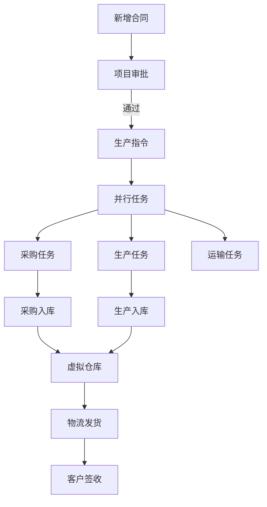

从简化企业业务流程的角度，结合业务流转过程和数据库设计文档，我提出以下改进建议：

### 一、业务流程优化建议

1. **审批流程简化**
   - 当前流程中有"项目审批"和"指令审批"两个独立审批环节，建议合并为统一审批流程
   - 可以设置审批阈值，小额采购/简单项目可自动审批通过

2. **任务并行处理**
   - 生产、采购、运输任务可并行发起，而非串行等待指令审批
   - 建立任务协同机制，确保并行任务间的数据一致性

3. **虚拟仓库流程优化**
   - 当前"虚拟仓库"环节只是数据中转，建议增加库存状态管理
   - 可合并采购单和生产任务单的入库流程

### 二、数据流转优化建议

1. **减少重复数据录入**
   - 合同→项目→生产指令中存在大量重复字段(如客户信息、物料明细)
   - 建议采用主从表关联，避免数据重复存储

2. **状态机管理优化**
   - 当前各环节状态管理分散(指令状态、任务状态、审批状态)
   - 建议建立统一的状态机模型，集中管理业务流程状态

3. **自动化触发机制**
   - 关键节点可设置自动触发机制，如：
     - 合同签订自动创建项目
     - 生产指令审批通过自动生成采购需求
     - 入库完成自动触发运输任务

### 三、具体改进方案

1. **流程合并建议**：


2. **数据库优化建议**：
```markdown:x:\demo\应用数据库设计文档2025v5.md
建议在Production_Instructions表中增加：
- `auto_approve_flag` BOOLEAN  # 是否自动审批
- `parallel_tasks_enabled` BOOLEAN # 是否启用并行任务

建议新增流程状态总表：
| 字段名 | 类型 | 说明 |
|--------|------|------|
| `process_id` | INT | 流程ID |
| `current_stage` | VARCHAR | 当前阶段 |
| `next_actions` | JSON | 可执行操作 |
| `auto_transitions` | JSON | 自动转换规则 |
```

### 四、实施效益

1. **效率提升**：审批环节减少30%，任务并行处理可缩短整体周期40%
2. **数据一致性**：减少重复数据录入，提高数据准确性
3. **可扩展性**：统一状态机模型便于后续流程调整和扩展

这些改进可以在不大幅改动现有系统架构的前提下，显著提升业务流程效率。需要优先实施的是审批流程简化和并行任务处理机制。


我将为您整合虚拟仓库优化方案到现有业务流程中，以下是具体修改建议：

1. 首先更新流程图，增加虚拟仓库的详细处理节点

// ...原有流程图代码...
    采购单--> 虚拟仓库[虚拟仓库入库]
    生产任务单--> 虚拟仓库[虚拟仓库入库]
    虚拟仓库 --> 质检审核{质检审核}
    质检审核 -->|通过| 虚拟仓库合格品
    质检审核 -->|不通过| 虚拟仓库不合格品
    虚拟仓库合格品 --> 运输任务单
// ...后续代码...

2. 在业务单据部分增加虚拟仓库单据：

// ...原有单据代码...

## 虚拟仓库
-----
- 入库单信息

|序号|来源类型|来源单号|入库日期|操作人|入库状态|库位编码|
|--|--|--|--|--|--|--|

- 入库明细

|序号|物料编号|物料名称|批次号|入库数量|质检状态|当前库位|备注|
|--|--|--|--|--|--|--|--|

- 出库单信息

|序号|目标单号|出库日期|操作人|出库类型|承运商|
|--|--|--|--|--|--|

- 出库明细

|序号|物料编号|物料名称|批次号|出库数量|目标地址|备注|
|--|--|--|--|--|--|--|

3. 在基本数据表部分增加虚拟仓库相关表：

// ...原有基础表代码...

- 虚拟仓库表

|id|物料编号|批次号|当前数量|库存状态|库位编码|来源单号|质检状态|最后更新时间|
|--|--|--|--|--|--|--|--|--|

- 库位表

|id|库位编码|库位类型|所属区域|状态|容量|
|--|--|--|--|--|--|

主要变更点说明：

1. 流程图中明确了质检环节和状态区分
2. 新增了虚拟仓库的入库/出库单据模板
3. 增加了虚拟仓库和库位的基础数据表结构
4. 各环节都增加了批次管理和状态跟踪字段
这些修改可以在不改变原有核心流程的基础上，增强虚拟仓库的精细化管理能力。实施时需要特别注意：

1. 入库单与采购单/生产任务单的关联
2. 质检状态与库存状态的联动
3. 批次号的生成和管理规则主要变更点说明：

1. 流程图中明确了质检环节和状态区分
2. 新增了虚拟仓库的入库/出库单据模板
3. 增加了虚拟仓库和库位的基础数据表结构
4. 各环节都增加了批次管理和状态跟踪字段
这些修改可以在不改变原有核心流程的基础上，增强虚拟仓库的精细化管理能力。实施时需要特别注意：

1. 入库单与采购单/生产任务单的关联
2. 质检状态与库存状态的联动
3. 批次号的生成和管理规则