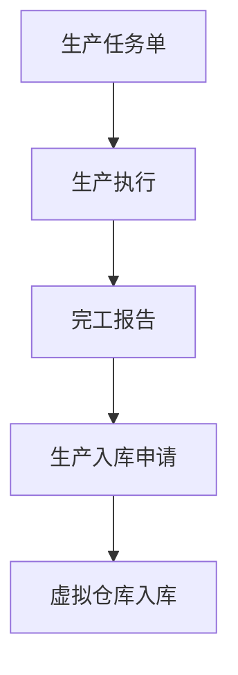

您观察得很准确，当前生产管理模块的子功能确实缺少了与生产入库相关的功能点。以下是需要补充的内容：

```
// ...原有生产管理模块内容...
### 3. 生产管理模块
- **子功能**：
  - 生产指令生成
  - 任务分配与调度
  - 生产进度跟踪
  - 生产完工报告
  - 生产入库申请
  - 异常处理
// ...后续模块内容...
```

对应的流程图也需要更新生产入库节点：



主要补充点说明：
1. 增加了"生产完工报告"子功能 - 用于记录生产完成情况
2. 增加了"生产入库申请"子功能 - 作为连接生产和虚拟仓库的桥梁
3. 更新了流程图，明确了从生产到入库的完整流程

这些补充确保了生产端到虚拟仓库的完整数据流转，与其他模块保持一致的精细化管理水平。